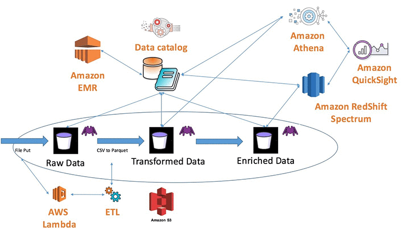
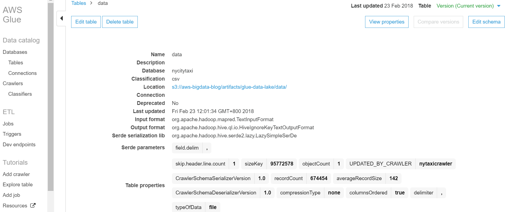
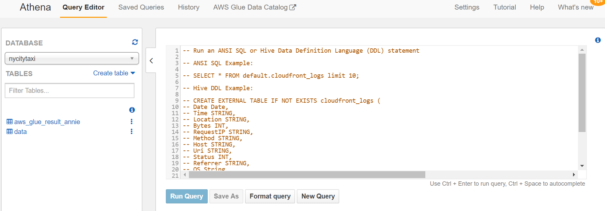
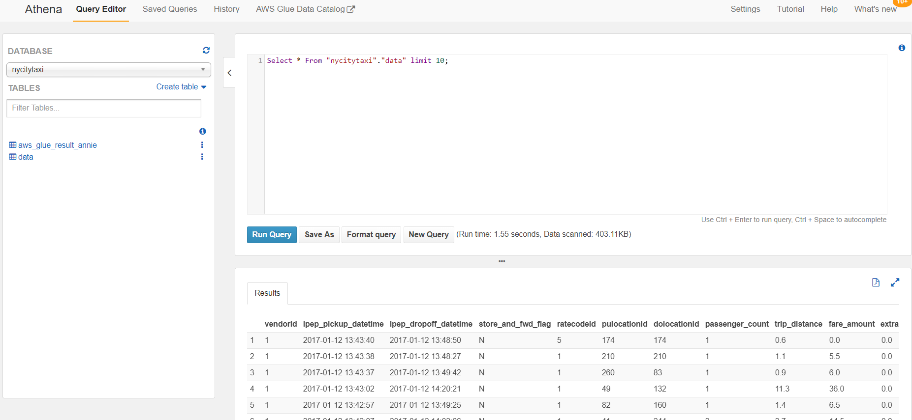

Building a Data Lake with AWS Glue and Amazon S3
===============================================================

## Scenario
The following procedures help you set up a data lake that could store and analyze data that addresses the challenges of dealing with massive volumes of heterogeneous data. A data lake allows organizations to store all their data—structured and unstructured—in one centralized repository. Because data can be stored as-is, there is no need to convert it to a predefined schema. This tutorial walks you define a database, configure a [crawler](https://docs.aws.amazon.com/glue/latest/dg/add-crawler.html) to explore data in an Amazon S3 bucket, create a table, transform the CSV file into Parquet, create a table for the Parquet data, and query the data with Amazon Athena.

## Architecture Diagram
AWS Glue is an essential component of an Amazon S3 data lake, providing the data catalog and transformation services for modern data analytics.

## Prerequisites

>Make sure you are in US East (N. Virginia), which short name is us-east-1.

## Lab tutorial
### Create IAM role

1.1. On the **service** menu, click **IAM**.

1.2. In the navigation pane, click **Roles**.

1.3. Click **Create role**.

1.4. For role type, choose **AWS Service**, find and choose **Glue**, and click **Next: Permissions**.

1.5. On the **Attach permissions policy** page, search and select **AmazonS3FullAccess**, **AWSGlueServiceRole**, and click **Next: Review** button.

1.6. On the **Review** page, enter the following detail:

* **Role name: AWSGlueServiceRoleDefault**

1.7. Click **Create role**.

1.8. Click **Roles** to switch page, click the role **AWSGlueServiceRoleDefault** you just created.

1.9. On the **Permissions** tab, click **add inline policy** on right side to create an inline policy.

1.10. On the JSON tab, paste in the following policy:

    {
        "Version": "2012-10-17",
        "Statement": [
        {
          "Effect": "Allow",
          "Action": [
            "logs:CreateLogGroup",
            "logs:CreateLogStream",
            "logs:PutLogEvents",
            "logs:DescribeLogStreams"
          ],
          "Resource": [
            "arn:aws:logs:*:*:*"
          ]
        }
      ]
    }

1.11. Click **Review policy**.

1.12. On the Review policy, enter policy name: **AWSCloudWatchLogs**.

1.13. Click **Create policy**.

1.14. Now confirm you have policies as below figure.

### Add Crawler
 
2.1. On the **Services** menu, click **AWS Glue**.

2.2. In the console, click **Add database**. In **Database name**, type **nycitytaxi**, and click **Create**.

2.3. Click **Crawlers** in the navigation pane, click **Add crawler**. Type **nytaxicrawler** for Crawler name and click **Next**.

2.4. On **Add a data store** page, select **S3** as the data store.

2.5. Select **Specified path in my account**.

2.6. Enter data source path **s3://aws-bigdata-blog/artifacts/glue-data-lake/data/** and click **Next**.

2.7. On **Add another data store** page, select **No**, and click **Next**.

2.8. Select **Choose an existing IAM role**, and choose the role  **AWSGlueServiceRoleDefault** you just created in the drop-down list, and choose **Next**.

2.9. For **Frequency**, choose **Run on demand**, and click **Next**.

2.10. For **Database**, choose **nycitytaxi**, and click **Next**.

2.11. Review the steps, and click **Finish**.

2.12. The crawler is ready to run. Click **Run it now**.

2.13. When the crawler has finished, one table has been added. Click **Tables** in the left navigation pane, and then click **data** to confirmed.

### Create S3 Buckets for Storage

3.1. On the **service** menu, click **S3**.

3.2. Click **Create bucket** button.

3.3. In **Bucket name**, type **nytaxi-original-data-xxxx** (where xxxx is you name). For example, if your name is Annie, the bucket name will be set as **nytaxi-original-data-annie**. If the bucket name has been used, please add a number to the end of bucket name.

3.4. In **Region**, select **US East (N. Virginia)**.

3.5. Click **Next** button.

3.6. Click **Next** button.

3.7. Disable the following options.

3.8. Click **Next** button.

3.9. Click **Create bucket** button.

### Transform the Data from CSV to Parquet Format

4.1. In the left navigation pane, under **ETL**, click **Jobs**, and then click **Add job**.

4.2. On the Job properties, enter the following details:

* **Name: nytaxi-csv-parquet**
    
* **IAM role**: choose **AWSGlueServiceRoleDefault**

4.3. For **This job runs**, select **A proposed script generated by AWS Glue**.

4.4. Click **Next**.

4.5. Choose **data** as the data source, and click **Next**.

4.6. Choose **Create tables in your data target**.

4.7. For Datastore, select Amazon S3, and select **Parquet** as the format.

4.8. For **Target path**, type **s3://aws-glue-result-xxxx** to store data where **`xxxx`** is your name.

4.9. Verify the schema mapping, and click **Finish**.

4.10. View the job. This screen provides a complete view of the job and allows you to edit, click **Save**, and click **Run job**. This steps may be waiting around 10 minutes.

### Add the Parquet Table and Crawler

5.1. When the job has finished, back to **AwS Glue console**, click **Tables** on left navigation pane.

5.2. Click **Add tables ->　Add tables using a crawler**, type Crawler name **nytaxiparquet** and click **Next**.

5.3. Choose S3 as the **Data store**.

5.4. Include path type **s3://aws-glue-result-xxxx** (where **`xxxx`** is your name) to store data.

5.5. Click **Next**.

5.6. On **Add another data store** page, select **No**, and click **Next**.

5.7. Select **Choose an existing IAM role**, and select the role  **AWSGlueServiceRoleDefault** you just created in the drop-down list, and click **Next**.

5.8. For **Frequency**, choose **Run on demand**, and click **Next**.

5.9. For **Database**, choose **nycitytaxi**, and click **Next**.

5.10. Review the steps, and click **Finish**.

5.11. The crawler is ready to run. Click **Run it now**.

5.12. After the crawler has finished, there are two tables in the **nycitytaxi** database: a table for the raw CSV data and a table for the transformed Parquet data.

### Query the Data with Amazon Athena

6.1. On the **Services** menu, click **Athena**.

6.2. On the **Query Editor** tab, choose the database **nycitytaxi**.

6.3. Choose the **aws_glue_result_xxxx** table.

6.4. Type below standard SQL to query the data:

    Select * From "nycitytaxi"."data" limit 10;

6.5. Click **Run Query**.

### Appendix - Analyze the data with Amazon Athena

Amazon Athena is an interactive query service that makes it easy to analyze data in Amazon S3 using standard SQL. Athena is capable of querying CSV data. However, the Parquet file format significantly reduces the time and cost of querying the data. 

To use AWS Glue with Amazon Athena, you must upgrade your Athena data catalog to the AWS Glue Data Catalog. For more information about upgrading your Athena data catalog, see this [step-by-step guide](https://docs.aws.amazon.com/athena/latest/ug/glue-upgrade.html).

## Conclusion

Congratulations! You now have learned how to:

* Build data lake using AWS Glue and Amazon S3.
* Crawler your data to Amazon S3 by AWS Glue.
* Analysis through Amazon Athena service.
